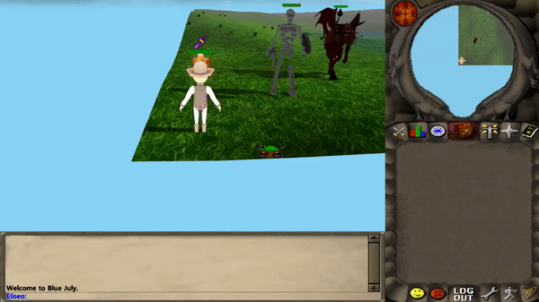

# Blue July
&emsp; &emsp; &emsp; &emsp; &emsp; &emsp; &emsp;


## Table of Contents
- [Blue July](#blue-july-engine)
- [Features](#features)
- [Controls](#controls)
- [Compilation and Running](#compilation-and-running)
- [Dependencies](#dependencies)
- [License](#license)

## Blue July Engine
Blue July is a 3D game engine written using the Java programming language
with LWJGL used as graphics API

## Features
* 3D Animation
* 2D textures
* Animated Models
* Audio Engine
* Font Renderer
* Transparency
* 2D and 3D Particle Systems
* Shadows
* Terrain
* Skybox
* 3D Water
* 3D Mouse Picker
* Minimap
* Chat Log

## Controls
* Arrow Keys - Rotate camera
* Left Click - Move character
* Mouse Scroll Wheel - Zoom in/out

## Compilation and Running
* change directory to the 'src' folder of the project,
  then running the following command:

```sh
javac Main.java
```

* IMPORTANT: You will need to add a resource folder for
the engine to find the resources used in Main.
You can also create your own Main.java and add your own resources.
Use the provided Main.java to see how it is structured

&emsp; &emsp; &emsp; &emsp; &emsp; &emsp; &emsp;


## Dependencies
* LWJGL
* Slick Utils
* OpenAL
* IMPORTANT: All dependencies are included in the lib folder

## License
Eliseo Copyright 2023
<br>
Code released under the [MIT License](LICENSE)
<br>
Some Textures used in the sample images are taken from Old School Runescape
which is owned by Jagex Ltd. It is not property of Eliseo
